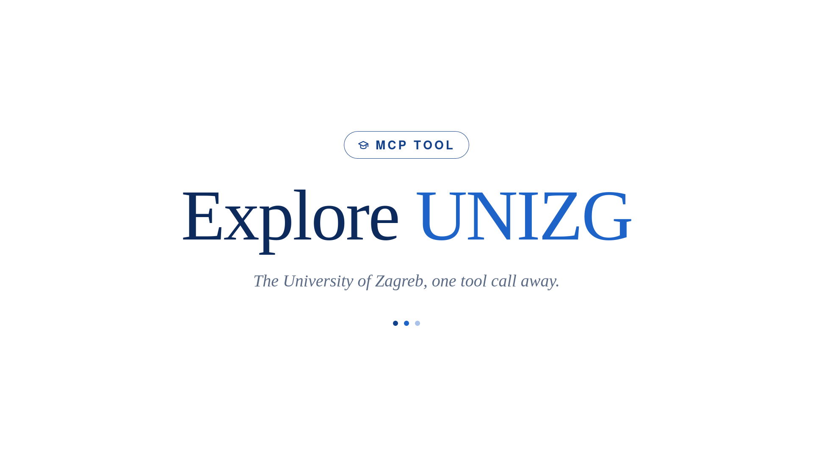

# explore_unizg

Two tools for planning studies at Sveučilište Josipa Jurja Strossmayera u Osijeku (SUJJS).

1. **Raspored kolegija**, a web app that turns a list of courses into a prerequisite graph and works
   out the earliest you could finish them.
2. **A course catalog server for Claude**, which answers what any SUJJS (Osijek) course covers, its
   ECTS, its literature and its prerequisites, straight from the official ISVU catalog. It can also
   hand you a study programme as JSON that you paste into the web app.

Stdlib Python and vanilla JS. No dependencies, no build step.

## 1. The web app

Run it:

```bash
python3 -m http.server 8000     # then open http://localhost:8000/
```

The default list is Programsko inženjerstvo (preddiplomski, redovni) at FERIT, Sveučilište Josipa
Jurja Strossmayera u Osijeku. Edit it, or replace it with any programme.

**Reading the graph.** One column per semester, grouped into years. An arrow means *prerequisite to
course*. A course sits in the first semester that is both after all its prerequisites and in its own
season, since zimski courses are only taught in odd semesters and ljetni in even ones. Hover a card to
light up everything upstream of it.

**Editing.** Click a course to set its name, semester, year, ECTS, whether it is obavezni or izborni,
and its prerequisites as `položen` or `odslušan`. Everything recomputes as you type. Courses with no
prerequisites can be dragged to a later semester of the same season if you want to push them back.

**The schedule.** `NAJRANIJE` is the earliest semester a course can be taken, `PLAN` is where the
official programme puts it, and a red arrow is the difference. The bars are ECTS load per semester.

**Buttons.** `Izvezi` saves your list as JSON, `Uvezi` loads one, `Zalijepi JSON` accepts pasted JSON,
`Vrati zadano` starts over. Your list is kept in the browser, so it survives a reload.

## 2. The catalog server for Claude

**Claude web and mobile.** Settings, Connectors, Add custom connector, and paste:

```
https://horizontal-mobility.vercel.app/api/mcp
```

**Claude Desktop or Claude Code.** Run it locally instead, nothing to deploy:

```json
{
  "mcpServers": {
    "unios-courses": {
      "command": "python3",
      "args": ["/absolute/path/to/explore_unizg/mcp/stdio_server.py"]
    }
  }
}
```

Then just ask in plain language. You never name a tool yourself, Claude picks one, but it helps to
know what is actually in there.

### The tools

Seven of them. Two things the six catalog ones share:

- **The faculty can be given as an id or as a name.** `165`, `FERIT`, `fakultet elektrotehnike` all
  work, and so do the other abbreviations people actually use (EFOS, PRAVOS, GFOS, MEFOS, FFOS). Ask
  `unios_institutions` if you want the id.
- **Everything accepts a year**, as the starting year: `2025` means 2025/2026. It goes back to
  the late 1990s/2000s depending on the faculty (not as far back as UNIZG's 1976/77), and
  2026/2027 is already published. Omit it and you get the current one.

---

#### `unios_institutions` — which faculties exist

The 18 SUJJS (Osijek) constituents with their ISVU ids, their city, and how many courses each one
has. Filter by a fragment of the name if you only want some. This is the lookup table behind
everything else, and usually Claude calls it without being asked.

#### `unios_courses` — find a course by name

Searches course names at one faculty, or **across all 18 at once if you leave the faculty out**. That
second mode takes about six seconds and is the honest way to answer *where else is this taught*.

Search ignores diacritics, so `racunarstvo` finds `Računarstvo`. What comes back is a list of names
with their šifre, which is what the next tool needs. If more courses matched than fit in the answer,
the result says how many there were in total and how they were spread across faculties, so you get
told when you are looking at a slice rather than everything.

> *Which Osijek faculties teach biologija?*

#### `unios_course` — everything about one course

The detail page for a single course, which is where most of the interesting material is:

- **Opis predmeta**, the syllabus, and the learning outcomes where they exist (they are prose inside
  the description, not a separate field).
- **Literatura**, split into required and recommended.
- **ECTS and opterećenje**, the hours per activity type. Hours per ECTS is computable from this, and
  nobody else publishes it.
- **Preduvjeti**, both for enrolling in the course and for sitting its exam, as `položen` or
  `odslušan`.
- **Every programme the course belongs to**, with its semester and whether it is obavezni or izborni
  in each. One course can legitimately sit at different semesters in different programmes, so this
  is a list and not a single value.

> *What does Programsko inženjerstvo at FERIT cover, and what is the reading list?*

#### `unios_programmes` — what a faculty offers

The programme and module tree for a faculty: prijediplomski, diplomski, doktorski and specialist
programmes, their delivery modes, and the ids the last two tools need. Parent nodes in the tree often
have no curriculum of their own, and the result marks which entries can actually be opened.

> *What can you study at GFOS?*

#### `unios_curriculum` — one programme, semester by semester

A full nastavni program: the obavezni courses in each semester, plus each elective group with the
minimum ECTS you have to take from it. This is the view that shows you the shape of a degree, and it
should come out near 30 ECTS per semester.

> *Show me the Programsko inženjerstvo programme at FERIT semester by semester.*

#### `unios_dag_json` — a programme as JSON for the web app

Exports courses in the schema the scheduler imports, so you can paste them straight into the app.

Two modes, and the difference matters. Give it a **`target`** course and you get that course plus
everything that feeds into it, transitively, which is normally five to twenty courses and a graph you
can read. Add `max_depth` to stop after a level or two. Leave `target` out and you get the entire
programme, which for a five year degree is around a hundred courses and a graph too dense to be
useful.

Two things it has to clean up on the way out, and it tells you when it did:

- **Duplicate course names.** A year-long course is often listed twice, once as a 0 ECTS placeholder
  and once as the credit-bearing row. The app keys its graph by name and would refuse the import, so
  those get merged, keeping the row with the credits and the union of their prerequisites.
- **Prerequisites pointing outside the programme.** They are free text and routinely name a course
  that has since been renamed or retired. Those edges get dropped, because one unresolvable name
  makes the app reject the whole import. It is reported, since it means the graph is genuinely
  missing something.

> *Give me the prerequisite chain for Programsko inženjerstvo at FERIT as scheduler JSON.*

#### `unios_mobility_rules` — the rules for studying at a second faculty

The only tool here that touches no network: it returns the rules for **horizontalna mobilnost**, taking
individual courses at another SUJJS (Osijek) faculty while staying enrolled on your own programme, and
how that differs from `paralelni studij`.

It exists because the catalog cannot answer the question students actually ask. ISVU tells you what is
taught where; it says nothing about whether you are allowed to go there, and guessing tends to go wrong
in one of two ways — refusing outright, or affirming it unconditionally and inventing a fee or a
deadline. So the rules are written down instead, with their sources: articles 36–37 of SUJJS's
*Pravilnik o studijima i studiranju*, adopted December 2023 (text confirmed via the September 2023
public-consultation nacrt; see [`docs/mobilnost-osijek-pravilnik.md`](docs/mobilnost-osijek-pravilnik.md)
for the full status of sources, including a newer March 2025 consolidated text whose mobility chapter is
unverified). Article 37 covers mobility between universities, including abroad, and points to Erasmus+
and other special agreements rather than SUJJS's own Pravilnik; the University separately publishes a
Pravilnik o Erasmus+ programu for that case.

The short version, which is the part worth knowing: **unlike UNIZG, this is not an unconditional
right.** Under article 36(1), enrolling a course at another smjer, study or sastavnica depends on your
own programme's nositelj having already provided for it in the studijski program — that is the thing to
check first, not a formality. There is a separate, university-wide list of izborni kolegiji the Senate
adopts every year (article 36(2)), open to any programme. ECTS earned this way are recognised either
inside your home programme or as a new izborni kolegij, confirmed by the host course's own nositelj.
Capacity is set per sastavnica, and costs are set by an Odluka Senata that has to be looked up
separately — the Pravilnik does not state a figure, and it does not mention a grade-average requirement
either way.

> *Can I take courses at another Osijek faculty while I study at FERIT?*

### Getting a programme into the web app

Ask for a course and what leads to it, for example *"give me the prerequisite chain for Programsko
inženjerstvo at FERIT as scheduler JSON"*. Claude returns a JSON block. Open the app, click
**Zalijepi JSON**, paste it, confirm.

Asking for one course and its chain is usually what you actually want. A whole programme imports fine,
it is just unreadable.

## Where the data comes from

The [ISVU public catalog](https://www.isvu.hr/visokaucilista/hr/pocetna), the official system SRCE runs
for the ministry: 18 SUJJS (Osijek) faculties, roughly 9,500 courses, years back to the late
1990s/2000s depending on the faculty. It is read live, nothing is cached in this repository.

Coverage is uneven because it is only as complete as each faculty made it. Semester and ECTS are almost
always there. Descriptions cover under half of courses, learning outcomes a third, prerequisites about
one in ten. **An empty field means the faculty published nothing, not that the course lacks the thing.**
Per-faculty figures are in [`skills/unios-courses/references/institutions.md`](skills/unios-courses/references/institutions.md).

The tools answer questions about teaching, not about people. Teacher names appear on course pages
because the faculties publish them there, but there is deliberately no way to search or rank by
professor.

### Horizontalna mobilnost, and which half comes from where

Searching every faculty at once answers what exists elsewhere and what you would be signing up for.
The rules are not in ISVU at all — they come from `unios_mobility_rules`, which carries SUJJS's own
position and its sources, written up at
[`skills/unios-courses/references/horizontalna-mobilnost.md`](skills/unios-courses/references/horizontalna-mobilnost.md).

Unlike UNIZG, whether you are even allowed to enrol a given course elsewhere is itself part of the
answer, not a formality left for the referada: article 36(1) conditions it on your own programme's
nositelj having already provided for that course in the studijski program. What is left for the
referada, once that is settled, is narrower: the form, the fee, the deadline, and whether the course has
room. Those, and only those, vary per faculty.

## Also in here

- [`skills/unios-courses/`](skills/unios-courses/): the same capability as an Agent Skill, plus
  `scripts/isvu.py` which works as a standalone CLI. `SKILL.md` documents the endpoints and the parsing
  traps.
- [`docs/mobilnost-osijek-pravilnik.md`](docs/mobilnost-osijek-pravilnik.md): the source text and
  status of the mobility rules (čl. 36–37), including which version of the Pravilnik is confirmed and
  which is not.
- [`kolegiji_dag/`](kolegiji_dag/): a Python version of the scheduler, used to check the browser one.
- [`docs/unizg-catalog-plan.md`](docs/unizg-catalog-plan.md): how the catalog was originally mapped for
  UNIZG, with measured coverage per faculty; kept as a historical record of that phase of the project.
- Tag [`v0-faculty-graph-app`](https://github.com/pitfa19/explore_unizg/tree/v0-faculty-graph-app): the
  earlier version of this project, a Django and Next.js app that clustered faculties by embedding
  similarity. It shares no code with what is here now.

## License

[MIT](LICENSE). Use it, fork it, ship it. If you build on it in published work, a citation is
appreciated: see [CITATION.cff](CITATION.cff), or GitHub's **Cite this repository** button.

Two things the license does not cover. The **course data** belongs to Sveučilište Josipa Jurja
Strossmayera u Osijeku and its faculties; this repository only queries what they already publish and
ships no dataset of it. And the
**archived app** at tag `v0-faculty-graph-app` is our hackathon solution (we didn't win...)